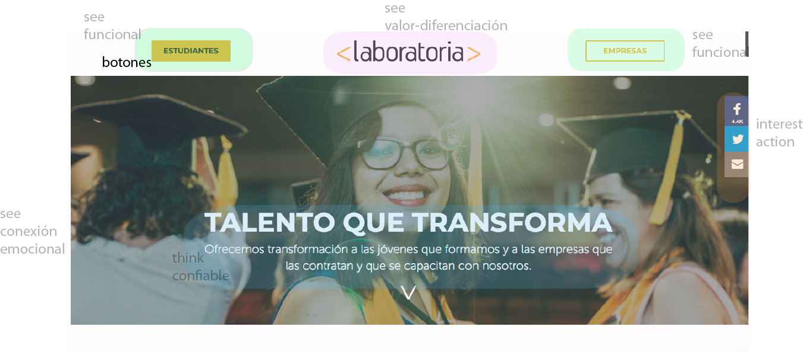
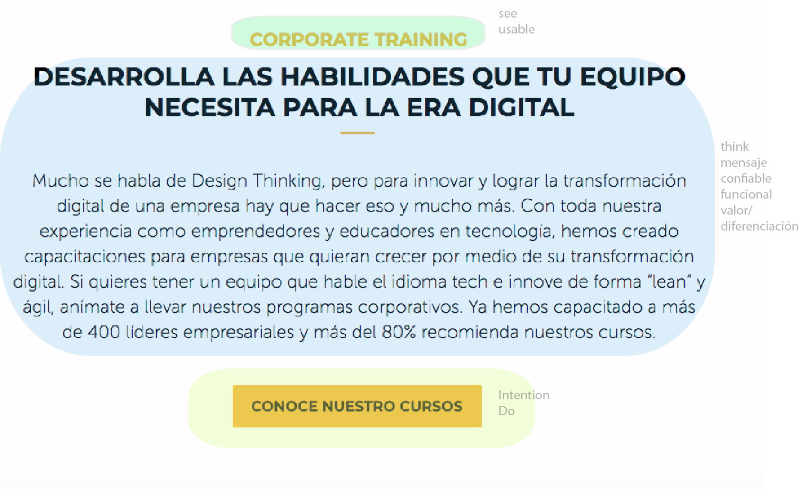

# WEBLaboratoria
* **Analis:** _Tipo Analis UX y UI de weblaboratoria_

****
Las partes que conforman el UX y UI en la pagina de laboratoria incluye la experiencia que sentimos al entrar en la pagina y ver en primer plano un background de una fotografía donde se ven unas mujeres felices y celebrando por su victoria una mas de frente y en un plano principal quien esta quien mira ligeramente hacia abajo, un poco mas arriba de la vista del usuario como haciendo hincapie en que ya esta mas arriba en que ya llego a esa transformación con una luz que destella de su sonrisa, con un título en letras blancas que dice -talento que transforma- y reafirma su vivencia.
En la pagina utilizan la tipografia Montserrat que queda perfectamente al ambiente con un palo seco que transmite una actitud joven e inovador.

En la parte de arriba hay un bloque de botones donde los usuarios pueden entrar a conocer sobre las ESTUDIANTES y las EMPRESAS para para que se sientan mas en relacion con laboratoria y al centro tenemos el logo de <Laboratoria> que te regresa a esta misma pagina como para referir de  nuevo a laboratoria.
Dentro de background de la fotografía principal lleva en el lado derecho una seccion de íconos de redes sociales.

En la pagina resalta los siguientes UX:

* Secciones de inspiracion donde se insipa para APRENDER A PROGRAMAR y TRABAJAR EN EL MUNDO TECH
 así como un botón que te lleva a -estudiantes-, su experiencia e insiracion donde te reafirman por qué estar en laboratoria, y donde puedes llenar un formulario para comenzar en este proceso; y si tienes dudas tambien una seccion de preguntas y respuestas mas usuales, y si tienes preguntas mas puntuales hay un icono de mensaje que te lleva a un chat donde puedes preguntar lo que quieras directamente a laboratorina.

* Tambien esta pensado para que las empreas que visitan la pagina contraten talento TECH
 y conozcan las empresas que han confiado en ellos en los diferentes paises  con su trayectoria.
* Interacción para acercarte más con laboratoria a través de sus redes sociales y Blog para  tener cerca a las actividades que lleva a cabo Laboratoria

* Botones con enlaces para acceder a más contenidos por you tube.
* Presenta a diferentes personas de grandes empresas que refuerzan el impacto que ha tenido el contratar egresadas de laboratoria
* Recuerda las habilidades que necesitas para tu empresa en esta nueva era digital.

## Algunos elementos UI a tener en cuenta

En la página resaltan los siguientes elementos:

* Elementos, subtitulos, botones con color #f7b617 (color de logotipo Laboratoria)
* Desplegables enlaces a redes sociales
* Contenido y texto alineados al centro (asi como logotipos de empresas, aliados, medios)
* Botones con enlaces (para conocer + acerca de Laboratoria, cursos, blog)
* Gama de color white, black and ##f7b617 (en bloques elementos-linea, botones y subtítulos)
* Tipografía Montserrat
* Uso de texto en blanco sobre las fotografías que estan como background
* Footer en fondo negro sobre letras blancas con links a contact,trabaja con nosotros,blog.
